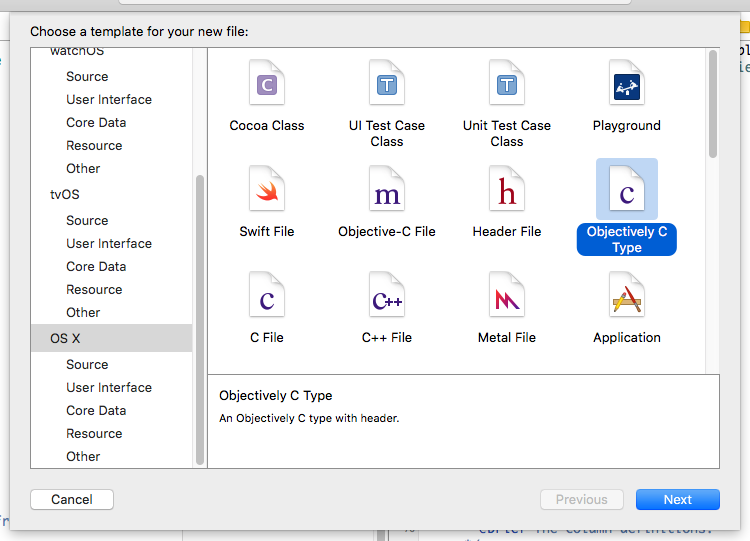
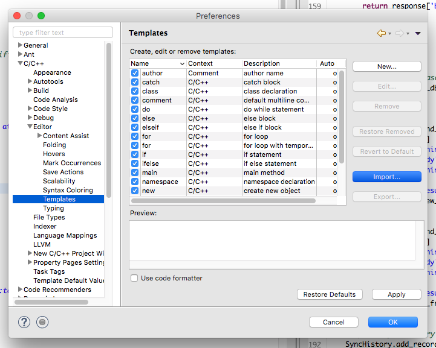

[](http://ci.quetoo.org/job/Objectively-Linux-x86_64/)
[](https://opensource.org/licenses/Zlib)


Objectively
===
Ultra-lightweight object oriented framework for [GNU C](http://www.gnu.org/software/gnu-c-manual/).

[Foundation](https://developer.apple.com/reference/foundation)-inspired [core library](http://jaydolan.com/projects/Objectively).

Zlib [license](./COPYING).

About
---
 Objectively is a cross-platform object oriented framework for the C programming language. Unlike [GObject](https://developer.gnome.org/gobject/stable/), Objectively is not a platform on which to build OO languages. Rather, Objectively provides rich OO semantics to enable object oriented programming directly in C. It is based on C99, but utilizes several GNU extensions, and therefore requires `gcc` or `clang`. While others may work, the following targets are actively supported:
 
 * Apple OS X with clang
 * Apple OS X with gcc
 * GNU / Linux with clang
 * GNU / Linux with gcc
 * [MinGW-w64](https://mingw-w64.org) cross compile
 * MinGW-w64 Windows native
 * Visual Studio 2015 or later with clang

Features
---
 * Single inheritance through _starts-with_ structure composition
 * `Class` and instance methods with strongly typed interfaces
 * Automatic class loading and lifecycle management
 * Automatic memory management with reference counting
 * Unicode and multibyte character set `String` support
 * `Object` primitives for `Boole`, `Date`, `Null`, `Number`, `String`
 * Mutable and immutable collections variants such as `Array` and `MutableDictionary`
 * JSON parsing, marshaling and introspection with `JSONSerialization` and `JSONPath`
 * Low-level concurrency constructs such as `Lock`, `Condition`, and `Thread`
 * High-level concurrency with `Operation` and `OperationQueue`
 * Resource loading via Internet protocols with `URLSession` and `URLSessionTask`

Adding Objectively to your project
---

1. Do the Autotools dance.

```shell
autoreconf -i; ./configure; make; sudo make install
```

2. Include the main header file in your source.

```c
#include <Objectively.h>
```

3. Use Objectively in your application.

```c
Object *obj = $(alloc(Object), init);
printf("%d\n", $(obj, hashCode));
release(obj);
````

4. Compile and link with Objectively.

```shell
gcc `pkg-config --cflags --libs Objectively` -o myprogram *.c
```

Declaring a custom type
---

Types in Objectively are comprised of 3 components:

1. The instance `struct`, beginning with the parent type, followed by the interface, and any instance variables.

```c
/**
 * @brief The Hello type.
 */
struct Hello {

	/**
	 * @brief The parent.
	 */
	Object object;

	/**
	 * @brief The interface.
	 */
	HelloInterface *interface;

	/**
	 * @brief The greeting.
	 */
	const char *greeting;
};
```

2. The interface `struct`, beginning with the parent interface, followed by any Class or instance methods.

```c
/**
 * @brief The Hello interface.
 */
struct HelloInterface {

	/**
	 * @brief The parent.
	 */
	ObjectInterface objectInterface;

	/**
	 * @static
	 * @fn Hello *Hello::helloWithGreeting(const char *greeting)
	 * @brief A factory method for instantiating Hello.
	 * @param greeting The greeting.
	 * @return A new Hello with the given `greeting`.
	 * @memberof Hello
	 */
	Hello *(*helloWithGreeting)(const char *greeting);

	/**
	 * @fn Hello *Hello::initWithGreeting(Hello *self, const char *greeting)
	 * @brief Initializes this Hello with the given `greeting`.
	 * @param self The Hello.
	 * @param greeting The greeting.
	 * @return The initialized Hello, or `NULL` on error.
	 * @memberof Hello
	 */
	Hello *(*initWithGreeting)(Hello *self, const char *greeting);

	/**
	 * @fn void Hello::sayHello(const Hello *self)
	 * @brief Prints this Hello's greeting to the console.
	 * @param self The Hello.
	 * @memberof Hello
	 */
	void (*sayHello)(const Hello *self);
};
```

3) The Class archetype, serving to tie 1. and 2. together.

```c
/**
 * @fn Class *Hello::_Hello(void)
 * @brief The Hello archetype.
 * @return The Hello Class.
 * @memberof Hello
 */
OBJECTIVELY_EXPORT Class *_Hello(void);
```

Implementing a type
---

To implement a type, implement its instance and Class methods and Class initializer:

```c
#include <stdio.h>
#include <Objectively.h>

#define _Class _Hello

/**
 * @fn Hello *HelloInterface::helloWithGreeting(const char *greeting)
 * @memberof Hello
 */
static Hello *helloWithGreeting(const char *greeting) {
	return $(alloc(Hello), initWithGreeting, greeting);
}

/**
 * @fn Hello *HelloInterface::initWithGreeting(Hello *self, const char *greeting)
 * @memberof Hello
 */
static Hello *initWithGreeting(Hello *self, const char *greeting) {

	self = (Hello *) super(Object, self, init);
	if (self) {
		self->greeting = greeting ? : "Hello World!";
	}
	return self;
}

/**
 * @fn void HelloInterface::sayHello(const Hello *self)
 * @memberof Hello
 */
static void sayHello(const Hello *self) {
	printf("%s\n", self->greeting);
}

#pragma mark - Class lifecycle

/**
 * @see Class::initialize(Class *)
 */
static void initialize(Class *clazz) {
 
	((HelloInterface *) clazz->def->interface)->helloWithGreeting = helloWithGreeting;
	((HelloInterface *) clazz->def->interface)->initWithGreeting = initWithGreeting;
	((HelloInterface *) clazz->def->interface)->sayHello = sayHello;
}

/**
 * @fn Class *Hello::_Hello(void)
 * @memberof Hello
 */
Class *_Hello(void) {
	static Class clazz;
	static Once once;

	do_once(&once, {
		clazz.name = "Hello";
		clazz.superclass = _Object();
		clazz.instanceSize = sizeof(Hello);
		clazz.interfaceOffset = offsetof(Hello, interface);
		clazz.interfaceSize = sizeof(HelloInterface);
		clazz.initialize = initialize;
	});
 
	return &clazz;
};
    
#undef _Class
```

Using a type
---
```c
Hello *hello = $$(Hello, helloWithGreeting, NULL);

$(hello, sayHello);

release(hello);
```
See [Hello.h](Examples/Hello.h) and [Hello.c](Examples/Hello.c) for the full source to this example.

Initialization
---
There is no explicit setup or teardown with Objectively. To instantiate a type, simply call `alloc` from anywhere in your program. The first time a type is instantiated, its Class initializer, `initialize`, is called. Use `initialize` to setup your interface, override methods, or initialize a library your class wraps. When your application terminates, an optional Class destructor, `destroy`, is also called.

Invoking an instance method
---
To invoke an instance method, use the `$` macro.

```c
    $(condition, waitUntilDate, date);
```

Invoking a Class method
---
To invoke a Class method, use the `$$` macro.

```c
    Dictionary *dict = $$(JSONSerialization, objectWithData, data);
```

Overriding a method
---
To override a method, overwrite the function pointer from within your Class' `initialize` method.

```c
    ((ObjectInterface *) clazz->def->interface)->dealloc = dealloc;
    ((ObjectInterface *) clazz->def->interface)->isEqual = isEqual;
```

Calling super
---
To invoke a supertype's method implementation, use the `super` macro.

```c
    super(Object, self, dealloc);
```

Managing memory
---
Objectively uses reference counting to govern object retention. Newly instantiated Objects have a reference count of 1. To retain a strong reference to an Object, call `retain(obj)`. To relinquish it, call `release(obj)`. Once an Object's reference count reaches 0, it is deallocated. Remember to balance every `retain` with a `release`.

Shared instances
---
A shared instance or _singleton pattern_ can be achieved through Class methods and _release-on-destroy_.

```c
static URLSession *_sharedInstance;

/**
 * @fn URLSession *URLSessionInterface::sharedInstance(void)
 * @memberof URLSession
 */
static *URLSession sharedInstance(void) {
	static Once once;

	do_once(&once, {
		_sharedInstance = $(alloc(URLSession), init);
	});

	return _sharedInstance;
}

/**
 * @see Class::destroy(Class *)
 */
static void destroy(Class *clazz) {
	release(_sharedInstance);
}

// ...

URLSession *session = $$(URLSession, sharedInstance);
```

Remember to wire up the desctructor in your Class' initialization block. See [Once.h](Sources/Objectively/Once.h) for details on `do_once`.
    
Examples & projects using Objectively
---

1. The Hello example above can be seen [here](Examples/Hello.c).
1. The [unit tests](Tests/Objectively) provide examples for using every Objectively class.
1. [ObjectivelyMVC](https://github.com/jdolan/ObjectivelyMVC) is a cross-platform user interface and interaction framework for SDL2 and OpenGL built on Objectively.


Code Templates
---
Objectively provides code templates for Xcode and Eclipse CDT that greatly cut down on the boilerplate required to declare and implement a type. These are _highly recommended_, as they will save you time and reduce errors in type declaration.

#### Xcode 8.x
Install the Xcode 8.x code templates by simply building the Xcode project.



#### Eclipse CDT
Install the Eclipse CDT templates through the Eclipse CDT preferences:



API documentation
---
The API documentation can be [browsed online](http://jaydolan.com/projects/Objectively) or generated with [Doxygen](http://www.doxygen.org) by running `make html`.
